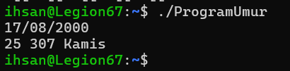

# Laporan Programming Assignment 1: Basic C++

## 1. Deskripsi Tugas
Tujuan dari *Programming Assignment 1* ini adalah untuk melengkapi sebuah *template* program C++ yang berfungsi menghitung umur pengguna (dalam satuan tahun dan bulan) serta menentukan hari kelahiran berdasarkan input tanggal lahir. 

Program ini memanfaatkan *library* standar `<ctime>` bawaan C++ untuk memproses dan memanipulasi struktur data waktu (`tm`), sehingga perhitungan selisih waktu dapat dilakukan dengan akurat.

## 2. Penjelasan Logika Program

Program ini memiliki tiga fungsi utama yang dimodifikasi, yaitu `yearsOld`, `monthsOld`, dan `dayOfDate`. Seluruh perhitungan didasarkan pada atribut di dalam *struct* `tm` seperti `tm_year` (tahun sejak 1900), `tm_mon` (bulan dari 0-11), dan `tm_mday` (tanggal hari ini).

### A. Fungsi `yearsOld` (Umur dalam Tahun)
Fungsi ini menghitung selisih antara tahun saat ini dengan tahun kelahiran. Setelah itu, program menggunakan pengkondisian `if` untuk memverifikasi apakah bulan dan tanggal kelahiran sudah terlewati pada tahun berjalan. Jika bulan saat ini lebih kecil, atau bulannya sama tetapi tanggalnya belum terlewati, maka total selisih tahun tersebut dikurangi 1.

### B. Fungsi `monthsOld` (Umur dalam Bulan)
Fungsi ini menghitung total akumulasi bulan. Logika utamanya adalah mengonversi selisih tahun menjadi bulan (dikali 12), lalu menambahkannya dengan selisih bulan saat ini dan bulan kelahiran. Sama seperti perhitungan tahun, jika tanggal kelahiran di bulan ini belum tercapai, maka total bulan dikurangi 1.

### C. Fungsi `dayOfDate` (Hari Kelahiran)
Alih-alih menggunakan algoritma perhitungan manual (seperti *Zeller's Congruence*), fungsi ini dirancang lebih efisien dengan memanfaatkan fungsi `mktime()` dari *library* `<ctime>`. Fungsi `mktime()` secara otomatis menormalisasi struktur waktu dan mengisi atribut `tm_wday` (hari dalam seminggu, di mana 0 = Minggu, 1 = Senin, dst.). Angka ini kemudian dipetakan ke dalam sebuah *array* string yang berisi nama-nama hari.

## 3. Implementasi Kode (Fungsi Utama)

Berikut adalah modifikasi untuk ketiga fungsi tersebut:

```cpp
int yearsOld(tm* inputTgl, tm* currentTgl) {
    int umur = currentTgl->tm_year - inputTgl->tm_year;
    if (currentTgl->tm_mon < inputTgl->tm_mon || 
       (currentTgl->tm_mon == inputTgl->tm_mon && currentTgl->tm_mday < inputTgl->tm_mday)) {
        umur--;
    }
    return umur;
}

int monthsOld(tm* inputTgl, tm* currentTgl) {
    int totalBulan = (currentTgl->tm_year - inputTgl->tm_year) * 12 + (currentTgl->tm_mon - inputTgl->tm_mon);
    if (currentTgl->tm_mday < inputTgl->tm_mday) {
        totalBulan--;
    }
    return totalBulan;
}

string dayOfDate(tm* inputTgl) {
    tm tempTgl = *inputTgl;
    mktime(&tempTgl);
    string namaHari[] = {"Minggu", "Senin", "Selasa", "Rabu", "Kamis", "Jumat", "Sabtu"};
    return namaHari[tempTgl.tm_wday];
}
```

